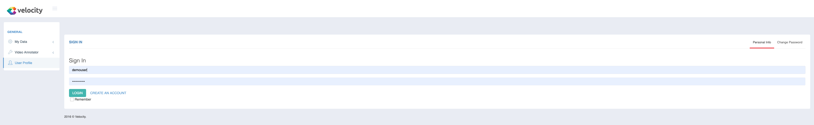
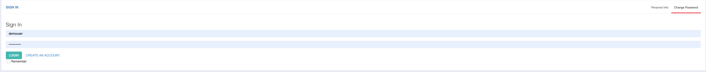
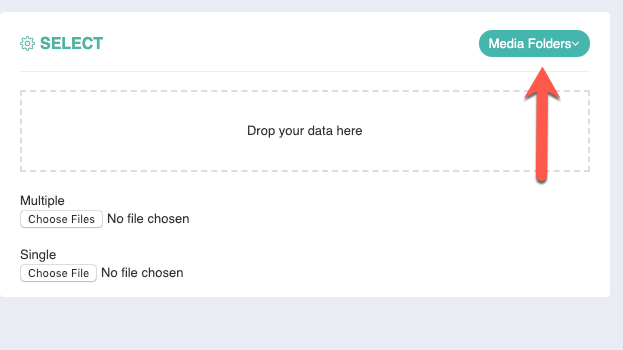
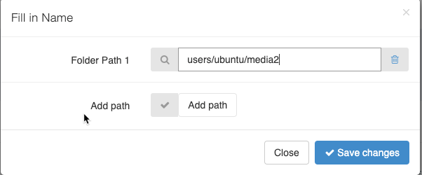

## Navigate to Upload Menu:

<iframe width="560" height="315" src="https://www.youtube.com/embed/Q3vcLwGLvdo" frameborder="0" allow="accelerometer; autoplay; encrypted-media; gyroscope; picture-in-picture" allowfullscreen></iframe>

Do not forget to change your password:

## Use media folder:

All media is stored under ~/media folder. You can add media to the media folder using ftp or cli and it will be injected into velocity.
You can add additional media folders by clicking on media folders edit.

Fill in the path to the folder and click save changes.

All the media files will be injected into velocity and you will be able to use them.