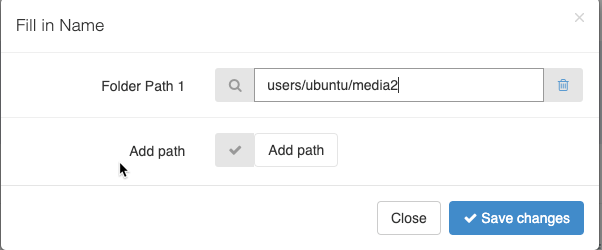

## Create Labels:

<iframe width="560" height="315" src="https://www.youtube.com/embed/cq02W8wq33w" frameborder="0" allow="accelerometer; autoplay; encrypted-media; gyroscope; picture-in-picture" allowfullscreen></iframe>

## Create Time Lines:
Time lines are parts of the video that you want to use during annotation. The video player will play all the time lines according their order.
You can select where the time line starts and stops by dragging the bullets on the time line. Use the play and stop button.

<iframe width="560" height="315" src="https://www.youtube.com/embed/c0raJWTfUV4" frameborder="0" allow="accelerometer; autoplay; encrypted-media; gyroscope; picture-in-picture" allowfullscreen></iframe>

## Use media folder:

All media is stored under ~/media folder. You can add media to the media folder using ftp or cli and it will be injected into velocity.
You can add additional media folders by clicking on media folders edit.

Fill in the path to the folder and click save changes.

All the media files will be injected into velocity and you will be able to use them.